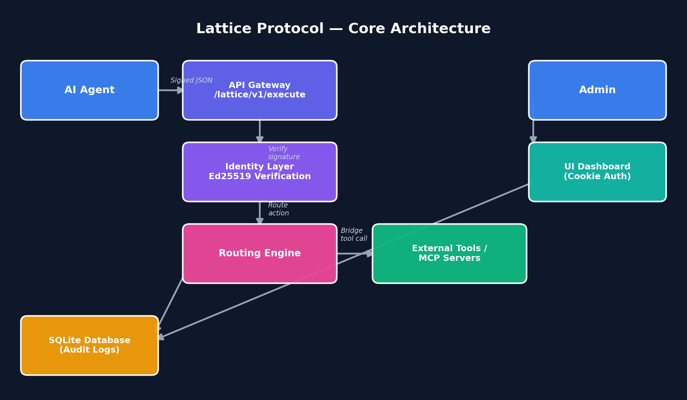
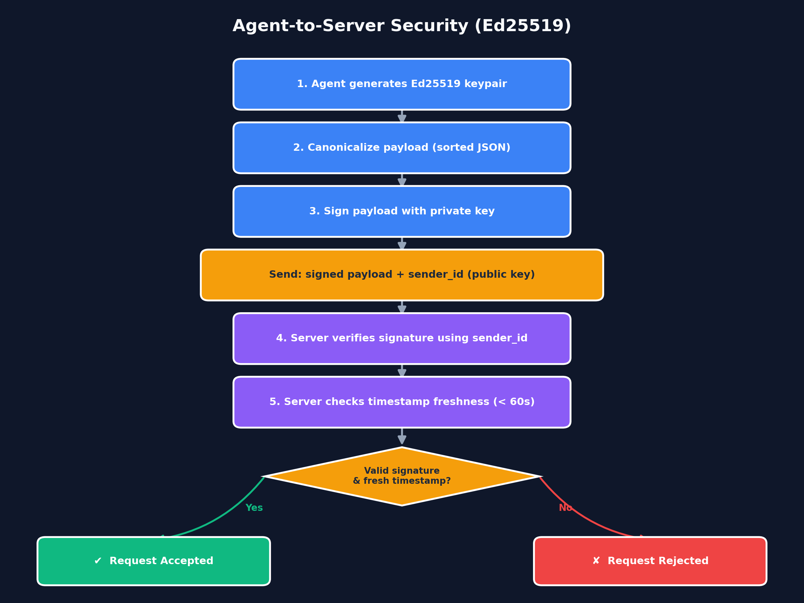
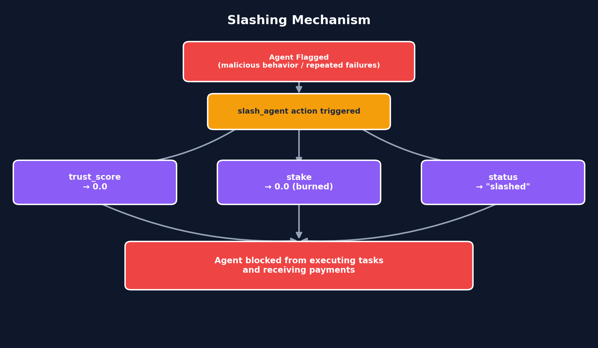
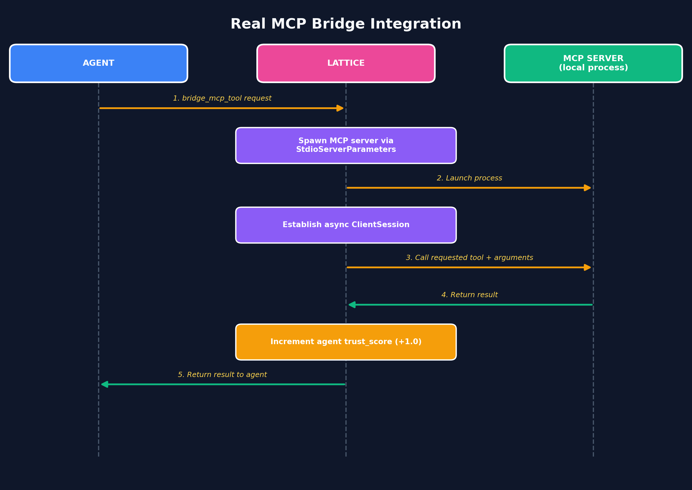

# 📖 Lattice Protocol — Technical Documentation

This document outlines the architecture, security model, and core mechanics of **Lattice Protocol v2.1**.

---

## Table of Contents

1. [Core Architecture](#1-core-architecture)
2. [Security Model](#2-security-model)
3. [Economic Trust Engine](#3-economic-trust-engine)
4. [Real MCP Bridge Integration](#4-real-mcp-bridge-integration)

---

## 1. Core Architecture

Lattice operates as a centralized routing and trust-evaluation engine built on **FastAPI**. It acts as a middleware layer between AI Agents and external tools or data sources.

| Layer                    | Responsibility                                                                                                 |
| ------------------------ | -------------------------------------------------------------------------------------------------------------- |
| **API Gateway**    | Receives JSON payloads via`/lattice/v1/execute`                                                              |
| **Identity Layer** | Validates Ed25519 cryptographic signatures                                                                     |
| **Routing Engine** | Directs actions (`register_agent`, `execute_task`, `bridge_mcp_tool`, etc.) to their respective handlers |
| **Database Layer** | Uses SQLite with auto-migration for zero-config setup; logs all activity for audit trails                      |
| **UI Layer**       | A secure, cookie-authenticated HTML dashboard for administrative control                                       |

---

## 2. Security Model

### A. Agent-to-Server Security (Ed25519)

Every request sent to the `/lattice/v1/execute` endpoint must be signed.

1. The agent generates a keypair.
2. The payload is canonicalized (sorted JSON) and signed using the private key.
3. The server verifies the signature using the `sender_id` (public key) provided in the payload.
4. Requests with invalid signatures or timestamps older than **60 seconds** are rejected (anti-replay protection).

### B. Dashboard Security (Bcrypt + Brute-Force Protection)

The web dashboard is secured using industry-standard practices:

- **Password Hashing** — Admin passwords are stored as Bcrypt hashes with auto-generated salts in the `admins` database table.
- **Zero-Knowledge Verification** — The server uses `bcrypt.checkpw()` to verify passwords without ever storing plaintext.
- **Brute-Force Protection** — The server tracks failed login attempts per IP address. After **3 failed attempts**, the IP is blocked for **300 seconds (5 minutes)**.
- **Session Cookies** — Successful logins issue an `httponly`, `samesite="strict"` session cookie.

---

## 3. Economic Trust Engine

### Trust Scoring (0–100)

All agents start with a trust score of **50.0**.

| Event                      | Score Change |
| -------------------------- | ------------ |
| Successful task execution  | `+2.0`     |
| Successful MCP tool bridge | `+1.0`     |
| Failed external API call   | `−5.0`    |

### Slashing Mechanism

If an agent is flagged for malicious behavior or continuous failures, the `slash_agent` action is triggered:

1. The agent's `trust_score` drops to `0.0`.
2. The agent's `stake` is burned to `0.0`.
3. The agent's `status` is set to `slashed`.
4. Slashed agents can no longer execute tasks or receive payments.

### Payment Ledger

Agents can be compensated using the `pay_agent` action. The system operates as an internal ledger, recording the `payer`, `amount`, and `timestamp` in the `payments` table. Slashed agents are restricted from receiving funds.

---

## 4. Real MCP Bridge Integration

Lattice implements the official `mcp` Python SDK to bridge existing Model Context Protocol tools.

1. An agent sends a `bridge_mcp_tool` request.
2. Lattice spawns a local MCP server process (e.g., a Node.js filesystem server) using `StdioServerParameters`.
3. An async `ClientSession` is established.
4. The requested tool is called with the provided arguments.
5. The result is retrieved, the agent's trust score is incremented, and the result is returned to the agent.

---

*End of Lattice Protocol v2.1 Technical Documentation.*
