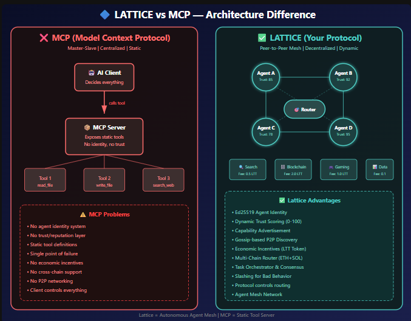

# 🔷 Lattice Protocol v2.0

**The Secure, Stateless Protocol for AI, Data, Blockchain, and Gaming.**

[](https://www.python.org/downloads/)
[](https://fastapi.tiangolo.com)
[](https://opensource.org/licenses/MIT)


## 📊 Architecture Comparison: Lattice vs MCP

g

## 📊 Architecture Comparison: Lattice vs MCP

## 🚀 Why Lattice?

| Feature             | MCP      | **Lattice**                  |
| ------------------- | -------- | ---------------------------------- |
| 🔒 Security         | API Keys | **Ed25519 Signing**          |
| ⛓️ Blockchain     | ❌       | **Ethereum + Solana**        |
| 🎮 Gaming           | ❌       | **Anti-Cheat HMAC**          |
| 📊 Data Engineering | ❌       | **ETL Pipelines**            |
| 🤖 AI Agent Swarms  | ❌       | **Multi-Agent Coordination** |
| 🧠 Vector DB        | ❌       | **pgvector Support**         |
| ⚡ Stateless        | ❌       | **✅ Built-in**              |

## 📦 Installation

```bash
pip install -r requirements.txt
```
